# [`example-codeplug`](https://github.com/mycodeplug/example-codeplug) walkthough

## Assumptions

* Windows 10
* Github.com Account [[Sign-up]](https://github.com/join)
* [Github Desktop Client](https://desktop.github.com/)
* [LibreOffice](https://www.libreoffice.org/download/download/)

The walkthrough will show screenshots of these tools, however
the concepts are applicable to excel, linux, or git command line.

## Fork [`example-codeplug`](https://github.com/mycodeplug/example-codeplug)

"Fork" means to make a linked copy of the example-codeplug that you can
edit without affecting the original.

Go to [https://github.com/mycodeplug/example-codeplug](https://github.com/mycodeplug/example-codeplug).
Click "Fork" (not the number next to it)

[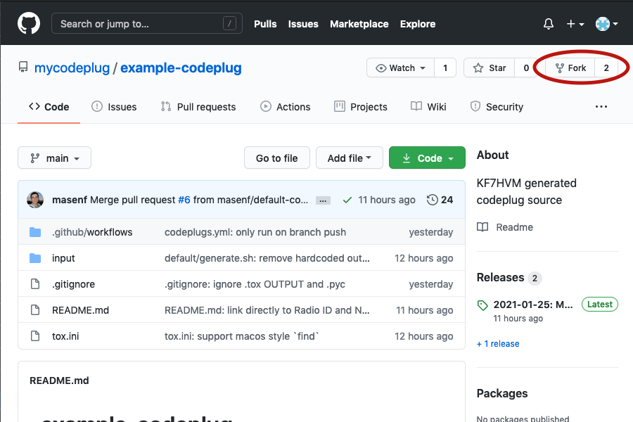](https://raw.githubusercontent.com/masenf/dzcb/walkthru/doc/walkthrough/forking.webm)

## Rename Your New Fork

Your new fork is a "git repository" containing the files needed to 
generate your customized codeplug. **You only need to make a
fork once.**

### Open Settings

Sometimes Settings is hidden behind the three dots menu.

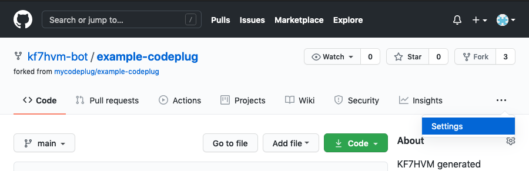

### Choose a new name

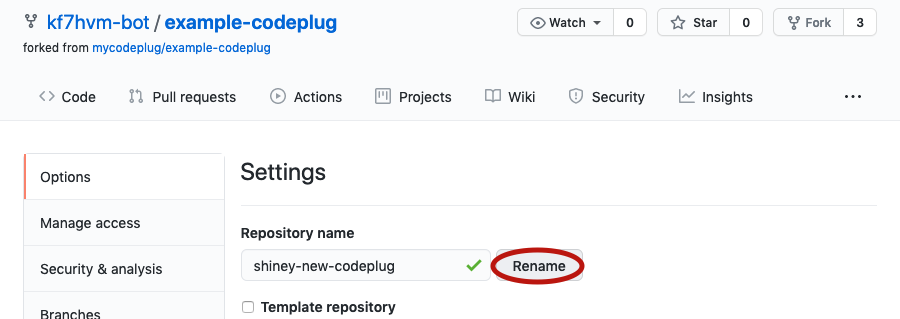

Click Rename.

## Enable Github Actions

Click Actions tab.

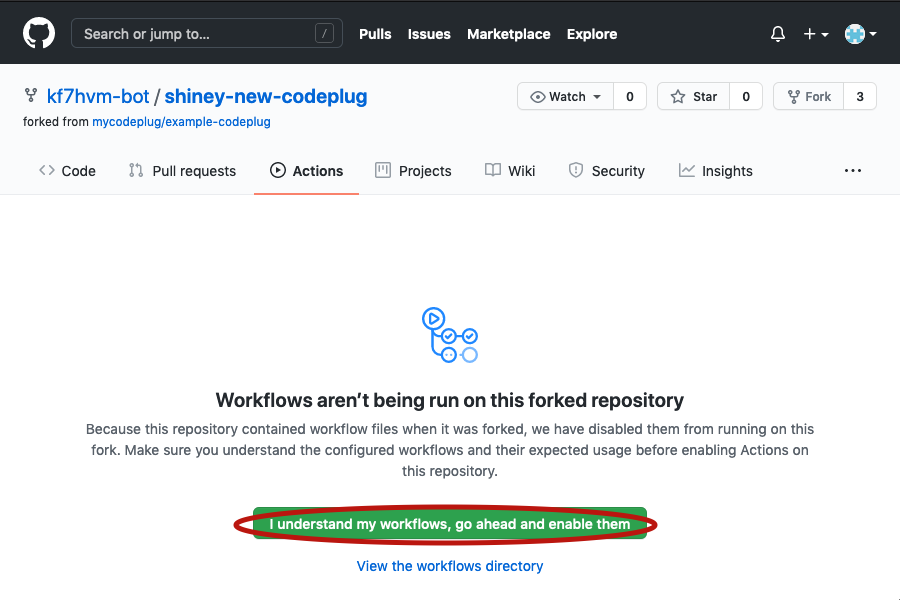

Click "I understand my workflows, go ahead and enable them"

# Customizing

To customize the codeplug, you need to download ("clone") the repository
to your computer. Modify the files in the `input` directory. Make a "commit"
describing your change. And finally upload ("push") the repository back to
Github to generate the codeplug.

## Clone your fork

Start Github Desktop and sign in with your Github Account.

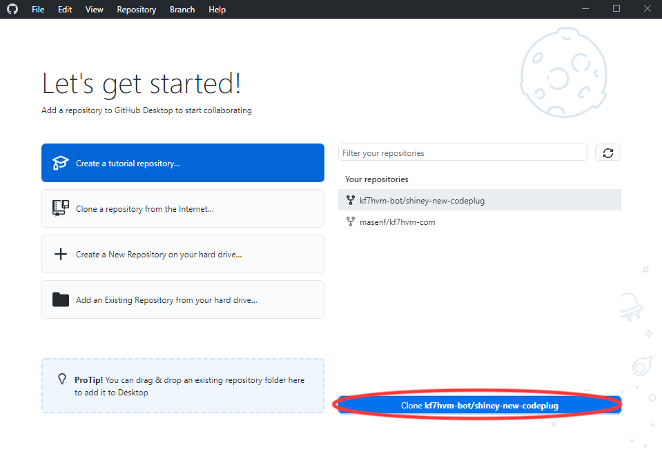

From the list of repositories, select your new fork ("shiney-new-codeplug"
in this example), and click "Clone youruser/your-codeplug". 

Next, choose where to download the repository, or keep the defaults.

Click Clone.

Wait patiently until asked
"How are you planning to use this fork?", then select
"For my own purposes".

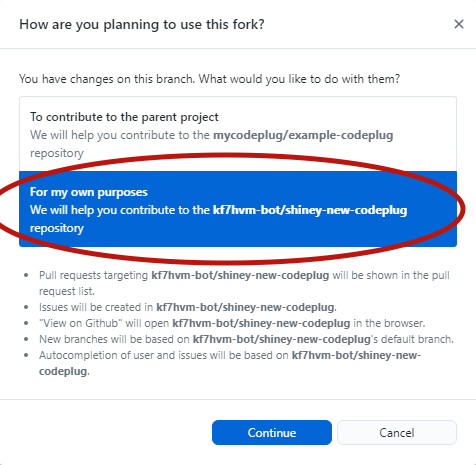

Click Continue.

## Make Changes to Source Files

From the repository main screen in Github Desktop, click
"Show in Explorer" to view the files

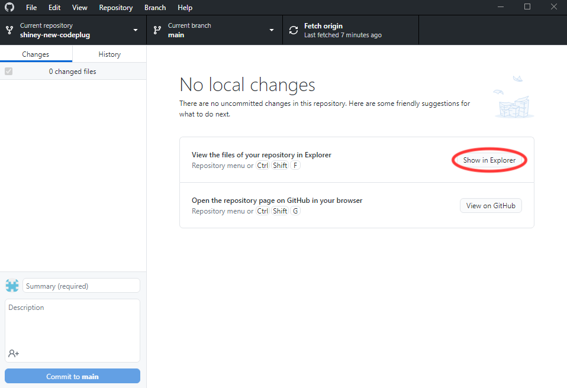

When the explorer window opens, double click "input" then "default"
to view the example code plug source files.

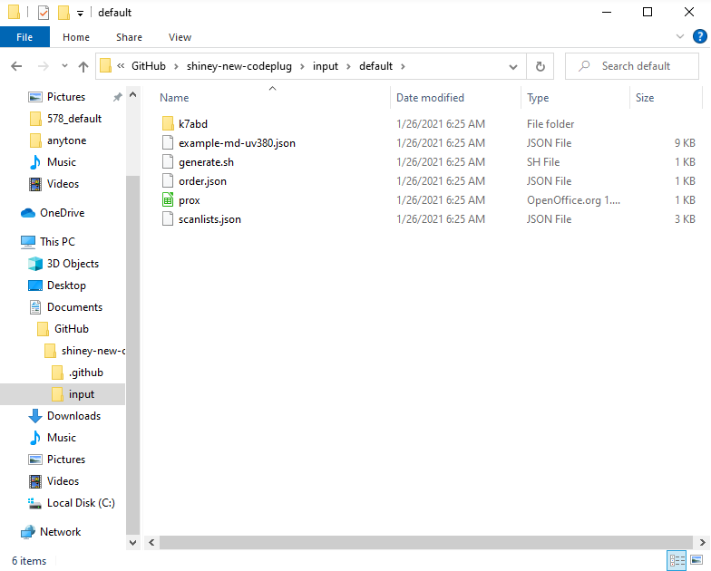

The `.json` and `.sh` files are plain text and can be opened with
notepad for editing.

### Set DMR Number and Callsign

Double click `example-md-uv380.json`, click the "More Apps ꜜ" link
and choose Notepad from the list.

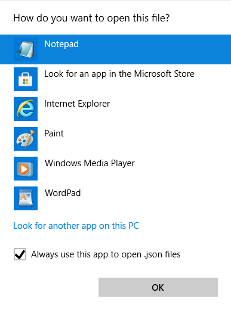

From Edit > Find... search for `"RadioID`.

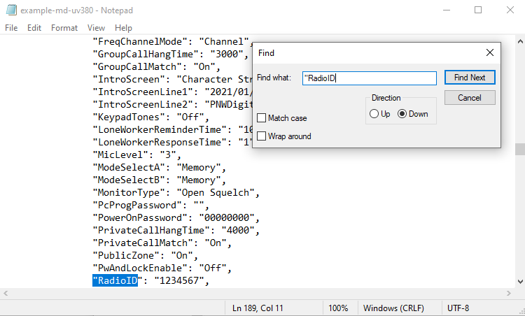

Replace "1234567" with your DMR number.

Scroll down a bit and replace "AA1AA" with your callsign

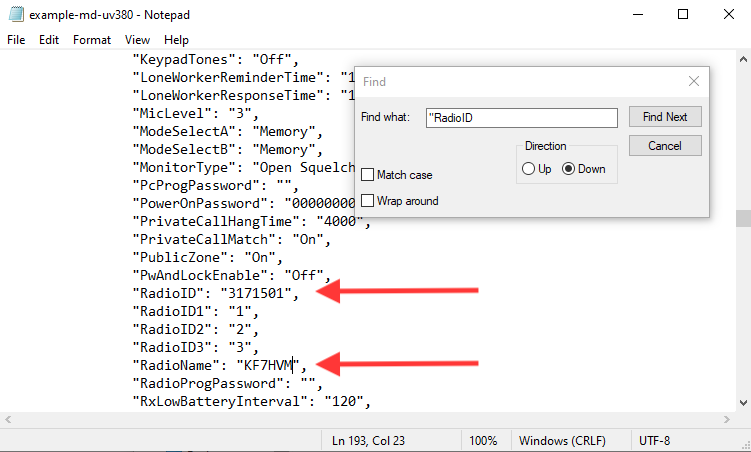

Close Notepad and save the file.

### Add a new Hotspot Talkgroup (example)

Open the "k7abd" directory and load "Talkgroups__Hotspot.csv" into
Libreoffice (or Excel).

Add the new talkgroup, BC on brandmeister, `30271`.

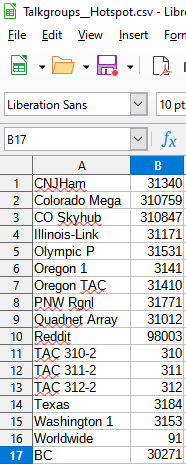

It may be convenient to keep your CSV files sorted alphabetically or otherwise,
however dzcb will re-order combined zones and expanded talkgroups according to
`order.json` (see below).

Save the file. **Use Text CSV Format!**

### Add a new Simplex Hotspot (example)

Load "Digital-Repeaters__Hotspot.csv". **Uncheck the "Semicolon" box when loading!**

The example file already includes 2 zones for a duplex
hotspot. To create a zone for a simplex hotspot, add
a new row based on the existing rows. You can also
rename the existing zones and modify the RX / TX frequencies
instead of creating a new row.

To the right of "Color Code" the remaining column headers correspond to
talkgroup names. Going across the row, a "-", "1", or "2" indicates
whether to create a channel in the zone on the given frequency and timeslot.

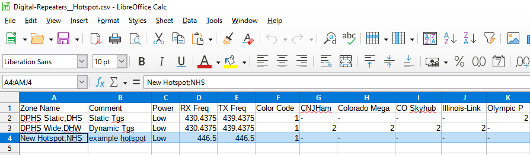

Next scroll to the far right and add a new column corresponding
to the "BC" talkgroup that was added in the previous section.

Enter a "-", "1", or "2" in each cell of the BC column indicating
whether the zone should create a channel for the talkgroup
on timeslot 1 or timeslot 2.

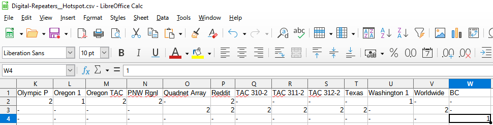

Save the file. **Use Text CSV Format!**

### Edit `order.csv`, `exclude.csv`, and `replacements.csv`

The newly added zone can be placed at the top of the zone list
by editing `order.csv` and adding a line matching the
new zone name.

**Any zones not in the list will follow in alphabetical order
(by K7ABD CSV filename)**.

The columns in these CSV files correspond to codeplug objects,
most commonly used are `contacts`, `channels`, and `zones`.

Each column should contain regular expressions that match
the name of the object of interest. See [README.md](/README.md#customization)
for further explaination of customizations.

Save the files. **Use Text CSV Format!**

### Commit changes

Switch back to Github Desktop and review the changes that were made.

In the lower left, describe the change and click "Commit to main"

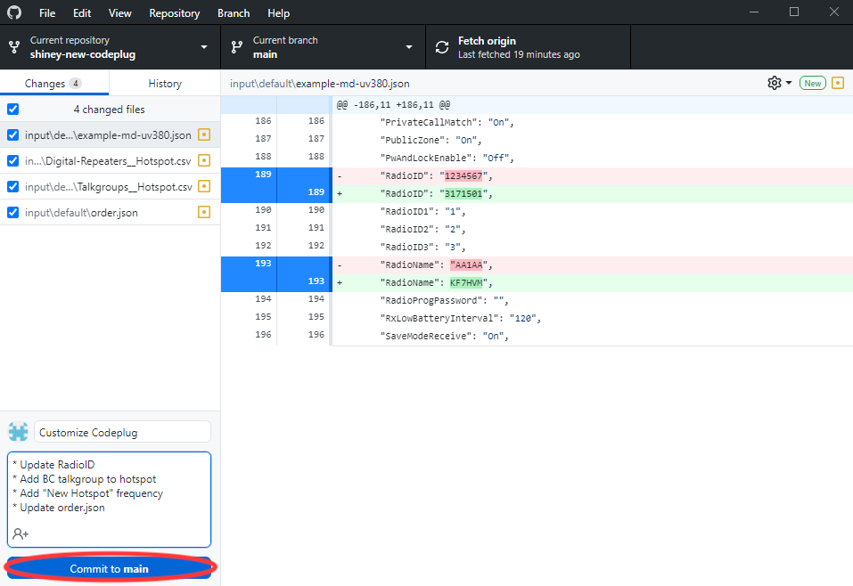

### Push commits

A "push" uploads your changes to github.com and starts the
codeplug generation.

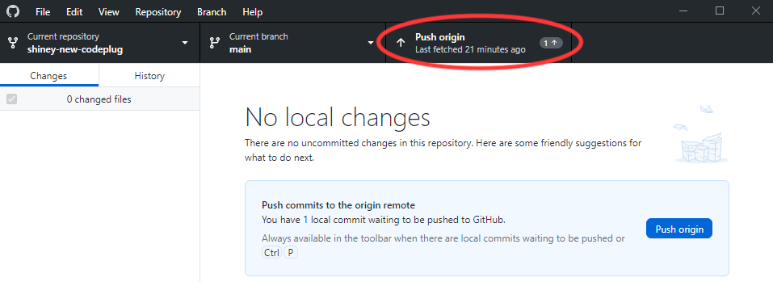

Click "Push origin"

### View progress

Click "View on Github"

When the browser opens, click the "Actions" tab. You should see the
codeplug being built.

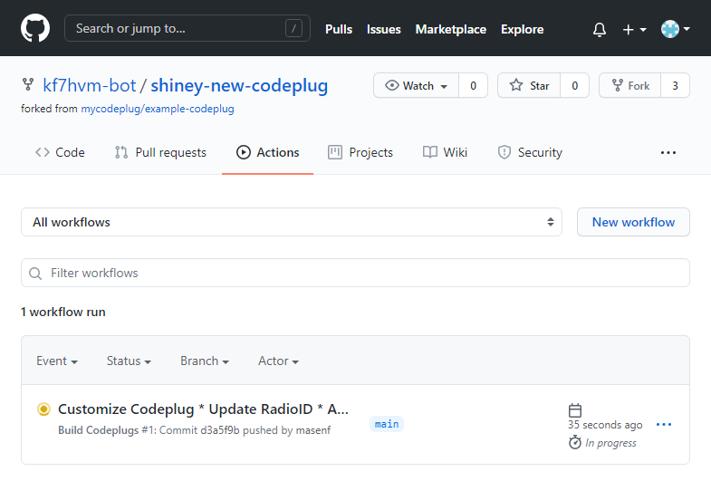

### Check Codeplug

After a minute or two, the codeplug should be ready. From the build
summary, scroll down to the "Artifacts" section to download
codeplugs.zip with the generated codeplug!

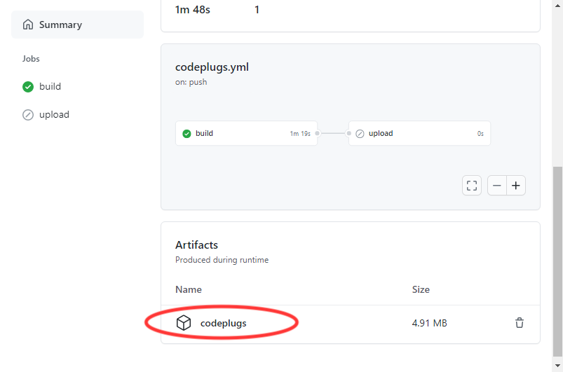

Import the files into your preferred CPS and check that
the new zone and channel is added.

# Enable Repeaterbook

The `prox.csv` file in the `input` directory identifies points
of interest used to download repeater information from repeaterbook.com.

## Add a new analog zone

Back in the "input\default" directory, open `prox.csv`.

Add new zones by providing coordinates, distance, and band
id (14 - 2 meter, 4 - 70 centimeter). Follow the existing
examples for guidance.

XXX: image below shows the old format! Follow the format in the
example-codeplug's `prox.csv` file.

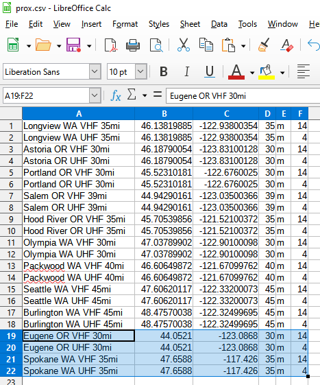

Save the file. **Use Text CSV Format!**

## Commit and push

Go back to Github Desktop, make a new commit, and Push
to origin as seen in a previous step.

Github Actions will build your changed codeplug.

# Publish and Share

After checking that the codeplug meets expectations and
is functional, go back to the Code tab of your forked repo
and select "Releases" in the right column.

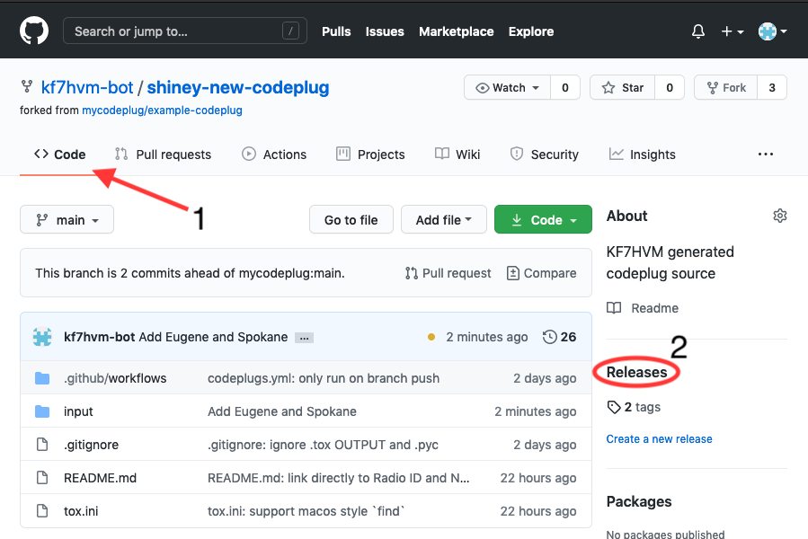

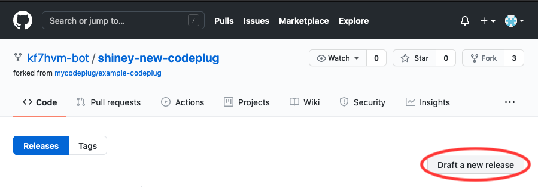

Click Draft a new release.

For the "Tag version" box, enter the date in ISO format: `2021-01-26`

"Release title" and "Describe this release" are optional and can
be edited later.

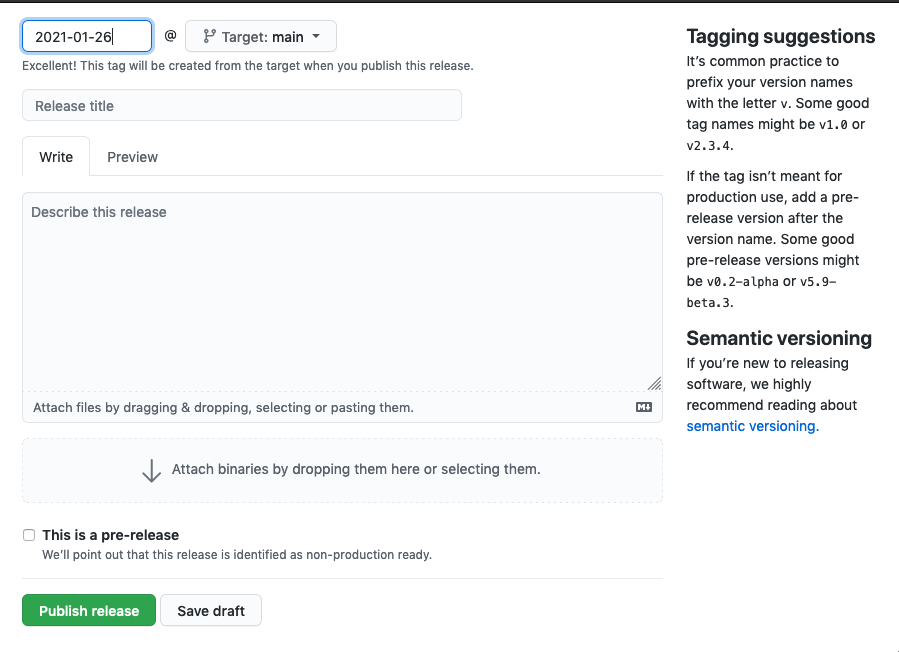

Click Publish release.

This will trigger another Github Actions rebuild of your codeplug.

Wait a few minutes and then refresh the page.

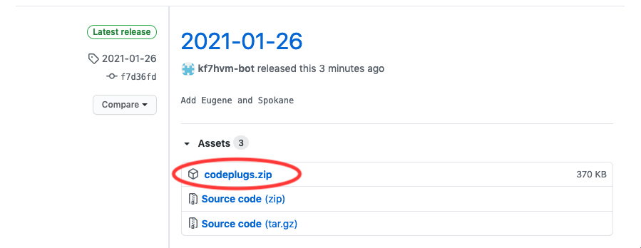

When the codeplug has been generated, you will see `codeplugs.zip`
under the "Assets" section of the release.

Github will host your codeplug indefinitely, you may right click
`codeplugs.zip` and "Copy link location" to share the generated codeplug
with others.
