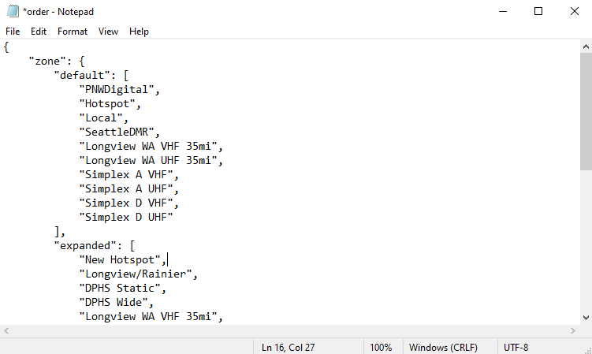

# [`example-codeplug`](https://github.com/mycodeplug/example-codeplug) walkthough

## Assumptions

* Windows 10
* Github.com Account [[Sign-up]](https://github.com/join)
* [Github Desktop Client](https://desktop.github.com/)
* [LibreOffice](https://www.libreoffice.org/download/download/)

The walkthrough will show screenshots of these tools, however
the concepts are applicable to excel, linux, or git command line.

## Fork [`example-codeplug`](https://github.com/mycodeplug/example-codeplug)

"Fork" means to make a linked copy of the example-codeplug that you can
edit without affecting the original.

## Rename Your New Fork

Your new fork is a "git repository" containing the files needed to 
generate your customized codeplug. **You only need to make a
fork once.**

### Open Settings

Sometimes Settings is hidden behind the three dots menu.

### Choose a new name

Click Rename.

## Enable Github Actions

Click Actions tab.

Click "I understand my workflows, go ahead and enable them"

# Customizing

To customize the codeplug, you need to download ("clone") the repository
to your computer. Modify the files in the `input` directory. Make a "commit"
describing your change. And finally upload ("push") the repository back to
Github to generate the codeplug.

## Clone your fork

Start Github Desktop and sign in with your Github Account.

From the list of repositories, select your new fork ("shiney-new-codeplug"
in this example), and click "Clone youruser/your-codeplug". 

Next, nhoose where to download the repository, or keep the defaults.

Click Clone.

Wait patiently until asked
"How are you planning to use this fork?", then select
"For my own purposes".

Click Continue.

## Make Changes to Source Files

From the repository main screen in Github Desktop, click
"Show in Explorer" to view and files

When the explorer window opens, double click "input" then "default"
to view the example code plug source files.

The `.json` and `.sh` files are plain text and can be opened with
notepad for editing.

### Set DMR Number and Callsign

Double click `example-md-uv380.json`, click the "More Apps ꜜ" link
and choose Notepad from the list.

From Edit > Find... search for `"RadioID`.

Replace "1234567" with your DMR number.

Scroll down a bit and replace "AA1AA" with your callsign

Close Notepad and save the file.

### Add a new Hotspot Talkgroup (example)

Open the "k7abd" directory and load "Talkgroups__Hotspot.csv" into
Libreoffice (or Excel).

Add the new talkgroup, BC on brandmeister, `30271`.

Save the file. **Use Text CSV Format!**

### Add a new Simplex Hotspot (example)

Load "Digital-Repeaters__Hotspot.csv". **Uncheck the "Semicolon" box when loading!**

The example file already includes 2 zones for a duplex
hotspot. To create a zone for a simplex hotspot, add
a new row based on the existing rows. You can also
rename the existing zones and modify the RX / TX frequencies
instead of creating a new row.

Next scroll to the far right and add a new column corresponding
to the "BC" talkgroup that was added in the previous section.

Enter a "-", "1", or "2" in each cell in the BC column indicating
whether the zone should create a channel for the talkgroup
on timeslot 1 or timeslot 2.

Save the file. **Use Text CSV Format!**

### Edit `order.json`

The newly added zone can be placed at the top of the zone list
by editing `order.json` and adding a line matching the
new zone name.

The first list, "default", orders zones based on the CSV file name
and is used for radios that do NOT expand static talkgroups into
channels (Radioddity OpenGD77).

The second list, "expanded", orders zones based on the zone name
in the CSV file and affects the zone order on Anytone and TYT radios.

Add a line to the top of the "expanded" list for the "New Hotspot".
(if you used a different name in the previous step, use that same
name here).

Close Notepad and save the file.

### Commit changes

Switch back to Github Desktop and review the changes that were made.

In the lower left, describe the change and click "Commit to main"

### Push commits

A "push" uploads your changes to github.com and starts the
codeplug generation.

Click "Push origin"

### Check progress

Click "View on Github" and click the "Actions" tab. You should see the
codeplug being built.

After a minute or two, the codeplug should be ready. From the build
summary, scroll down to the "Artifacts" section to download
codeplugs.zip with the generated codeplug!

